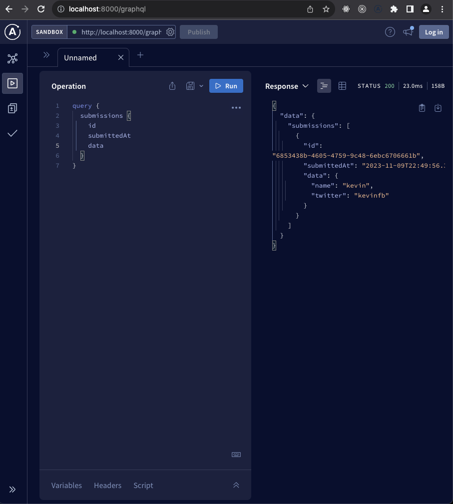

## formhub-be

A `nodejs` based backend running as docker container.

- `prisma` for type generation
- `knex` for data migrations
- `graphQL` for data operations
- `typescript` strong typing
- `bullmq` queuing the jobs
- `redis` for caching
- `docker` for local development
- use `docker-compose up` to bring alive all 3 containers: `postgres`, `redis`, `backend`

### scripts

- `build` for prod build
- `start` to start in dev mode
- `db:console` to look into and query postgres
- `rebuild:be` only rebuild backend, if made any changes or install/change new deps
- `docker:db:migrate` to generate db structure (table) in db
- `build:prisma` to generate typescript types to further facilitate development

### How does it look from graphQL designer

